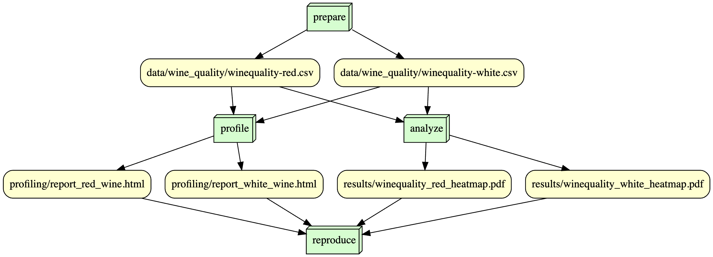

# is477-fall2023-final-project: Wine Quality Analysis
Public repository for IS477 Fall 2023 final project

## Overview

The purpose of this public repository and the project is to reproduce the data respecting the transparency and reproducibility of the data and the analysis conducted by others. This project also explores the automation of data science workflows pipelines. 

The dataset used in this project displays the results of the physicochemical tests of wine samples to determine the quality of wine - red and white wines in separate csv.file - solely based on the chemical contents of each wine sample and does not include the brand details, prices, or ingredients. The goal of this dataset is to model the regression relationship on how acidity, certain chemicals (chlorides, sulfur dioxide, sulfates), density, and pH level affect the wine quality. Based on this results, this project will reproduce to determine how each variables are correlated with the wine quality by projecting the correlation heatmaps and matrix tables for each red and white wine. 

```
Link to the dataset: https://archive.ics.uci.edu/dataset/186/wine+quality
```

## Analysis

Based on the correlation results of the wine quality dataset, there are no significant correlation between certain chemical contents with the wine quality. Majority of the chemical variables have correlation between -0.4 and 0.4 with wine quality, indicating they have very weak relations to the wine quality. One variable that is noticeable could be alcohol variable. The alcohol content and red and white wines had correlation rate of 0.48 and 0.44. This displays moderatelly positive correlation between the wine quality and the alcohol level, meaning there could be moderate possibiliity that higher alcohol level could lead to higher wine quality. 
        
    

## Workflow

Below is the DAG for the Snakemake workflow:



## Reproducing

To reproduce the workflow for the final project - wine quality dataset:

```
docker run --rm -v ${PWD}:/is477 sarapark4/is477-fall2023:final-project snakemake --cores 1 --snakefile .Snakefile reproduce
```

To clean:

```
docker run --rm -v ${PWD}:/is477 sarapark4/is477-fall2023:final-project snakemake --cores 1 --snakefile .Snakefile reproduce --delete-all-output
```


## License

This project uses following license:

- Software license: MIT

- Data license: CC-BY-4.0


## References

Wine Quality Dataset. (2009). UCI Machine Learning Repository. https://doi.org/10.24432/C56S3T

